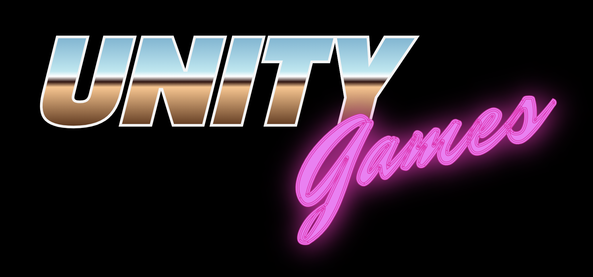
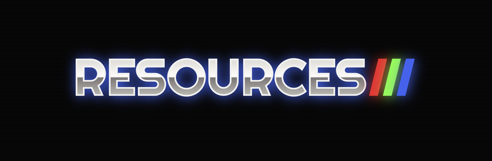

  
  

<h1 align="center">Awesome Unity Games 🎮</h1>
<h4 align="center">A curated list of awesome Unity Games (Open Source), code examples and resources.</h4>

  
  

    <i>Credits to https://codepen.io/boldfacedesign/pen/EoGgD</i>
  

## Adventure
- [San Andreas Unity](https://github.com/GTA-ASM/SanAndreasUnity) - An open source reimplementation of GTA San Andreas game engine in Unity.

## Puzzle
- [Nodulus](https://github.com/Hyperparticle/nodulus) - A puzzle game with a clever twist. Based on the mathematical theory behind plank puzzles, consists of a grid of cubes and rods which can be rotated with a swipe.
- [Angry Birds style game](https://github.com/dgkanatsios/AngryBirdsStyleGame) - An effort to replicate a level and relevant mechanisms of Rovio's famous Angry Birds game, built in Unity game engine. Source code is provided for educational purposes.
- [Match-3 game](https://github.com/dgkanatsios/MatchThreeGame) - A match-3 game in Unity (like Candy Crush and Bejeweled).

## Role
- [Darkest Dungeon](https://github.com/Reinisch/Darkest-Dungeon-Unity) - Darkest Dungeon port in Unity. Almost completely identical to the original.

## RPG
- [Hogwarts](https://github.com/OpenHogwarts/hogwarts) - A Hogwarts (Harry Potter) open sandbox game made in Unity.

## Runner
- [InfiniteRunner3D](https://github.com/dgkanatsios/InfiniteRunner3D) - Creating an infinite 3D runner game in Unity.

## Sandbox
- [CubeWorld](https://github.com/federicodangelo/CubeWorld) - Minecraft like game made in Unity.

## Shooter
- [Multiplayer-FPS](https://github.com/Armour/Multiplayer-FPS) - A multiplayer first-person shooter game based on Unity3D. Different types of input devices are supported, including Kinect, Xbox controllers, Leap motion, and VR Glasses.

## Strategy
- [Starcraft Unity3D](https://github.com/coconauts/startcraft-unity3d) - A recreation of the classic Starcraft game by Blizzard, on Unity3D.

---

  

## Code Examples
- [Basics](./CODE_BASICS.md)
- [Intermediate](./CODE_INTERMEDIATE.md)

## Augmented reality
- [ARCore](https://developers.google.com/ar/develop/unity) - Build new augmented reality experiences that seamlessly blend the digital and physical worlds. Transform the way people play, shop, learn, create, and experience the world together—at Google scale.
- [ARKit](https://developer.apple.com/augmented-reality) - Build unparalleled augmented reality experiences for hundreds of millions of users on iOS and iPadOS, the biggest AR platforms in the world.
- [Vuforia](https://engine.vuforia.com/engine) - The World’s Most Widely Deployed AR.

## Virtual Reality

- [Innoactive Creator](https://github.com/Innoactive/Creator) - Scalable and maintainable Unity-based VR training.
- [Innoactive Creator Examples](https://github.com/Innoactive/Creator-Examples) - Simple examples showcasing the capabilities of the Innoactive Creator.
- [XR-Interaction-Toolkit-Examples](https://github.com/Unity-Technologies/XR-Interaction-Toolkit-Examples) - Various examples to use with the XR Interaction Toolkit.
- [OpenVR XR](https://github.com/ValveSoftware/unity-xr-plugin) - OpenVR plugin for Unity's XR API.

## Controllers
- [2D-Platformer-Hunter](https://github.com/ta-david-yu/2D-Platformer-Hunter) - A 2D Platformer Controller in Unity.

## Editor
- [Runtime Unity Editor/Debugging Tools](https://github.com/ManlyMarco/RuntimeUnityEditor) - In-game inspector and debugging tools for applications made with Unity3D game engine.
- [Path-Creator](https://github.com/SebLague/Path-Creator) - An intuitive and lightweight editor for quickly creating smooth paths in the editor.
- [UIWidgets](https://github.com/UnityTech/UIWidgets) - A Unity Package which helps developers to create, debug and deploy efficient, cross-platform Apps.

## Scripting
- [ScriptableObject-Architecture](https://github.com/DanielEverland/ScriptableObject-Architecture) - Makes using Scriptable Objects as a fundamental part of your architecture in Unity super easy.
- [UniRx](https://github.com/neuecc/UniRx) - Reactive Extensions for Unity.
- [C-Sharp-Promise](https://github.com/Real-Serious-Games/C-Sharp-Promise) - Promises library for C# for management of asynchronous operations.
- [FSM_Command_Patterns](https://github.com/hansschaa/FSM_Command_Patterns) - A basic platform game developed for help to undertanding State pattern and Command pattern.

## Networking
- [RestClient](https://github.com/proyecto26/RestClient) - 🦄 Simple HTTP and REST client for Unity based on Promises, also supports Callbacks! 🎮.

## Platforms
- [Native Toolkit](https://github.com/ryanw3bb/unity-native-toolkit) - Easily integrate native iOS & Android functionality into Unity projects.

## Utilities
- [Yarn Spinner](https://github.com/YarnSpinnerTool/YarnSpinner) - A tool for building interactive dialogue in games!
- [Unity2D Components](https://github.com/cmilr/Unity2D-Components) - A varied collection of Unity3D components that I've built for use in the 2D Platformer/RPG I'm currently developing.
- [Unity Image Cropper](https://github.com/yasirkula/UnityImageCropper) - A uGUI based image cropping solution for Unity 3D.
- [ChainSafe Gaming](https://github.com/ChainSafe/web3.unity) - Unity SDK for building games that interact with blockchains.

## Guides
- [Coding in C# in Unity for beginners](https://unity3d.com/learning-c-sharp-in-unity-for-beginners) - The very basics of coding, like variables, functions and classes, and how to use them.
- [Design Patterns Written in Unity3D](https://github.com/QianMo/Unity-Design-Pattern) - All Gang of Four Design Patterns written in Unity C# with many examples.

## Tutorials
- [Introduction to Roll-a-Ball](https://youtu.be/RFlh8pTf4DU) - An introduction to the Roll-a-ball project, showing the final game and describing what will be covered in this tutorials.
- [Setting up the Game](https://youtu.be/W_fAidYRGzs) - Creating a new project and setting up the basic game.
- [Moving the Player](https://youtu.be/7C7WWxUxPZE) - Moving the player object using player input and physics forces.
- [Moving the Camera](https://youtu.be/Xcm5H2J95iI) - Moving the camera relative to the player.
- [Setting up the Play Area](https://youtu.be/dahT0wRVO1Q) - Setting up the play area.
- [Creating Collectable Objects](https://youtu.be/HlDGSStxuHI) - Creating and placing the "Pick Up" collectables.
- [Collecting the Pick Up Objects](https://youtu.be/XtR29MmzuT0) - Collecting the pick-up objects; discussing physics, collisions and triggers.
- [Displaying the Score and Text](https://youtu.be/bFSLI2cmYYo) - Counting, displaying text and ending the game.
- [Building the Game](https://youtu.be/hSg3e1M3hKY) - Building the game as a Standalone application.
- [Scripts as Behaviour Components](https://youtu.be/Z0Z7xc18CcA) - Learn about the behaviour component that is a Unity script, and how to Create and Attach them to objects.
- [Variables And Functions](https://youtu.be/-c1RsydH2nA) - What are Variables and Functions, and how do they store and process information for us?
- [Conventions and Syntax](https://youtu.be/0mks0QaWCNQ) - Learn about some basic conventions and syntax of writing code.
- [If Statements](https://youtu.be/PQihrWCOSic) - How to use IF statements to set conditions in your code.
- [Loops](https://youtu.be/Jefkb3Gm7vE) - How to use the For, While and Do-While Loops as well as the For Each loop to repeat actions in code.
- [Scope and Access Modifiers](https://youtu.be/_0oBLCJcpCs) - Understanding variable & function scope and accessibility.
- [Awake and Start](https://youtu.be/4QdjoV63wjM) - How to use Awake and Start, two of Unity's initialisation functions.
- [Update and FixedUpdate](https://youtu.be/u42aWzAIAqg) - How to effect changes every frame with the Update and FixedUpdate functions, and their differences.
- [Vector Maths](https://youtu.be/e3z91RqZPAk) - A primer on Vector maths - as well as information on the Dot and Cross products.
- [Enabling and Disabling Components](https://youtu.be/PCdg3cnQfZ4) - How to enable and disable components via script during runtime.
- [Activating GameObjects](https://youtu.be/MhPFB-rAdlg) - Learn about the behaviour component that is a Unity script, and how to Create and Attach them to objects.
- [Translate and Rotate](https://youtu.be/32JkMANaMpk) - How to use the two transform functions Translate and Rotate to effect a non-rigidbody object's position and rotation.
- [LookAt](https://youtu.be/cAAqf5J7_9w) - How to make a game object's transform face another's by using the LookAt function.
- [Destroy](https://youtu.be/pRDj3jss5t8) - How to use the **Destroy** function to remove GameObjects and Components at runtime.
- [GetButton and GetKey](https://youtu.be/-A7D5Rcumz4) - How to get button or key for input and how these axes behave / can be modified with the Input manager.
- [GetAxis](https://youtu.be/MK4OmsViqMA) - How to "get axis" based input for your games in Unity and how these axes can be modified with the Input manager.
- [OnMouseDown](https://youtu.be/c69oZprM1oc) - How to detect mouse clicks on a Collider or GUI element.
- [GetComponent](https://youtu.be/xbDKC4zP9XY) - How to use the GetComponent function to address properties of other scripts or components.
- [DeltaTime](https://youtu.be/Gcoj3llfzSw) - What is Delta Time and how can it be used in your games to smooth and interpret values.
- [DataTypes](https://youtu.be/IVcx-tSxjys) - Learn the important differences between Value and Reference data types, in order to better understand how variables work.
- [Classes](https://youtu.be/odKtPBsyFnw) - How to use Classes to store and organise your information, and how to create constructors to work with parts of your class.
- [Instantiate](https://youtu.be/Q3u0x8VRJS4) - How to use Instantiate to create clones of a Prefab during runtime.
- [Arrays](https://youtu.be/Zn4BDIXhy-M) - Using arrays to collect variables together into a more manageable form.
- [Invoke](https://youtu.be/-YgM4DXGeq4) - The Invoke functions allow you to schedule method calls to occur at a later time.
- [Enumerations](https://youtu.be/L2E2aB1CMYw) - Enumerations allow you to create a collection of related constants.
- [Switch Statements](https://youtu.be/-PWvI3q6_OE) - Switch statements act like streamline conditionals. They are useful for when you want to compare a single variable against a series of constants.
- [Events](https://youtu.be/k4JlFxPcqlg) - Learn how to use special delegates called Events in order to subscribe methods (functions) to create flexible broadcast systems in your code.
- [Creating a Text Based Adventure Part 1](https://youtu.be/jAf1I1UWo5Q) - Learn how to program a text based adventure game in which the player explores a series of rooms by reading text and inputting commands via the keyboard.
- [Creating a Text Based Adventure Part 2](https://youtu.be/Bak8azAM_cA) - Learn how to to display the descriptions of all the items in a room when we enter it.
- [How to Play Test Game Mods (Official Unity Tutorial)](https://youtu.be/kZCJmKVQAPQ) - In the Play Testing In-Editor Tutorial, you will learn how to play and mod your Microgame in Unity.

## Tools
- [OpenUPM](https://openupm.com) - Open Source Unity Package Registry.

## YouTube Channels
- [Brackeys](https://www.youtube.com/user/Brackeys/videos) - Game Dev Tutorials

## Architecture
- [SOLID](https://github.com/ugonnathelma/articles/blob/master/the-solid-principles-in-pictures/the-solid-principles-in-pictures.md) - The S.O.L.I.D Principles in Pictures.
- [.Net Documentation](https://github.com/proyecto26/dotnet-documentation) - SOLID, DI, N-Tier, Logs, etc with dotnet.

## Other Awesome Lists
- [GameDev-Resources](https://github.com/Kavex/GameDev-Resources) - A wonderful list of Game Development resources.
- [awesome-unity3d](https://github.com/insthync/awesome-unity3d) - A categorized collection of awesome opensource unity3d repos.
- [Awesome Unity Open Source on GitHub (800+)](https://github.com/baba-s/awesome-unity-open-source-on-github) - A categorized collection of awesome Unity open source on GitHub.
- [Awesome Unity FREE](https://github.com/netpyoung/awesome-unity-free) - A community driven list of useful Unity Game Engine "FREE" packages, libraries and others.
- [Awesome Unity Community](https://github.com/UnityCommunity/AwesomeUnityCommunity) - A categorized community-driven collection of high-quality awesome Unity assets, projects, and resources.

## Concepts
* **3DOF:** A term often used in the context of virtual reality, refers to tracking of rotational motion only: pitch, yaw, and roll.
* **6DOF:** Refers to the freedom of movement of a rigid body in three-dimensional space.

## Supporting 🍻
I believe in Unicorns 🦄
Support [me](http://www.paypal.me/jdnichollsc/2), if you do too.

Donate **Ethereum**, **ADA**, **BNB**, **SHIBA**, **USDT**, **DOGE**:

> Wallet address: 0x3F9fA8021B43ACe578C2352861Cf335449F33427

Please let us know your contributions! 🙏

## Happy coding 💯
Made with ❤️

